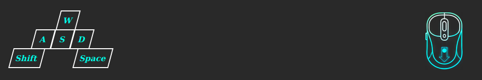

# linux-overlay

A simple OBS overlay for Linux that displays the state of keyboard and mouse buttons.



## Customization

- Customize the keys and mouse buttons to monitor ([`./dist/config.yaml`](./dist/config.yaml))
- Customize the behavior of the overlay ([`./dist/web/events.js`](./dist/web/events.js))
- Customize the appearance of the overlay ([`./dist/web/main.css`](./dist/web/main.css))
- Customize the layout of the overlay ([`./dist/web/index.html`](./dist/web/index.html))

## Build

[Go](https://go.dev/dl/) is required to build the overlay. Please make sure you are running Go 1.23 or later.

```sh
$ ./build.sh
```

## Run

```sh
$ sudo ./dist/overlay
```

## Configuration

The configuration file is located at `dist/config.yaml`.